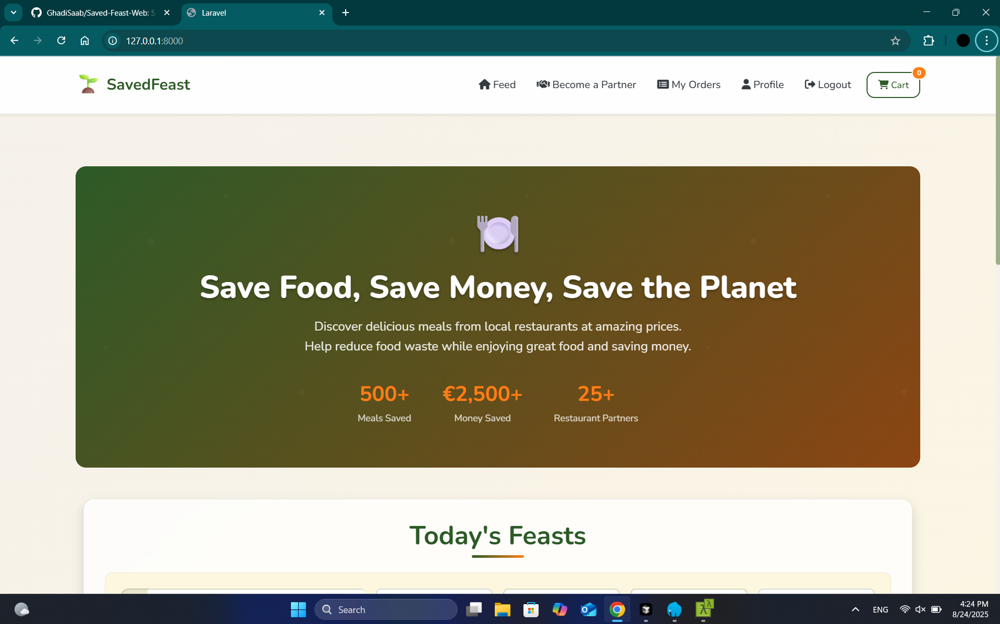
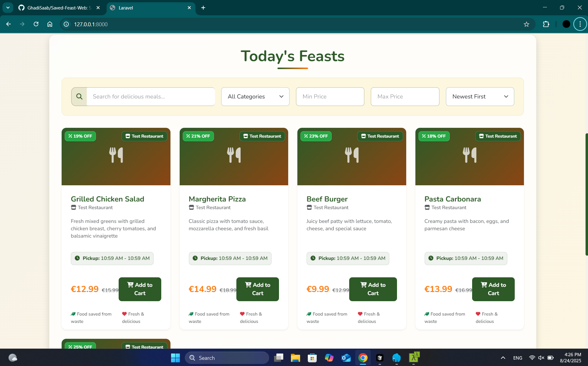
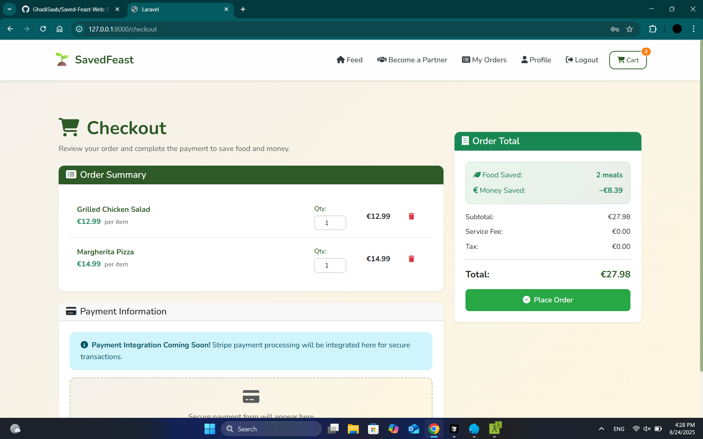
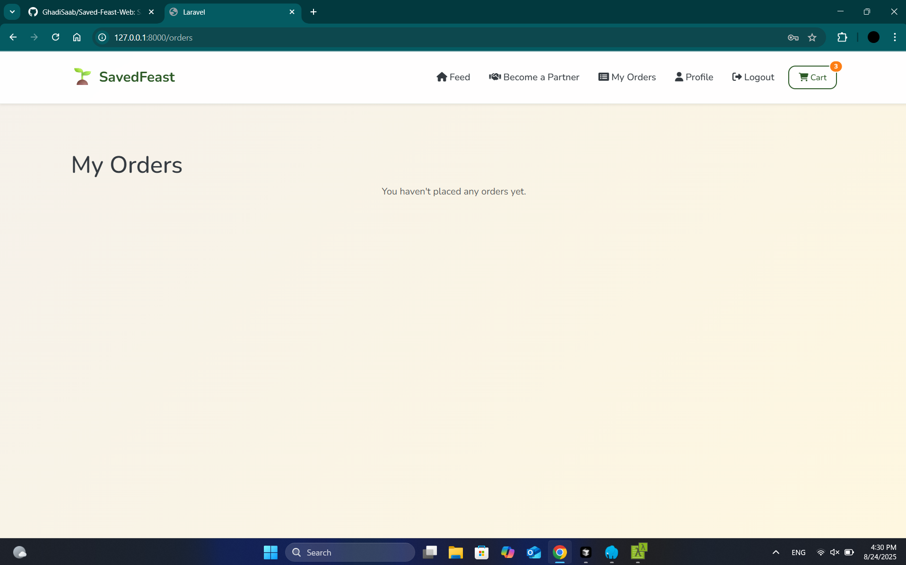
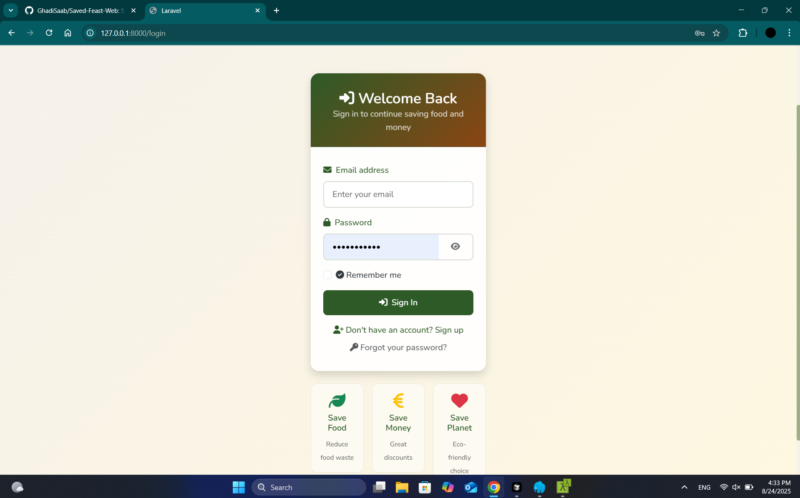
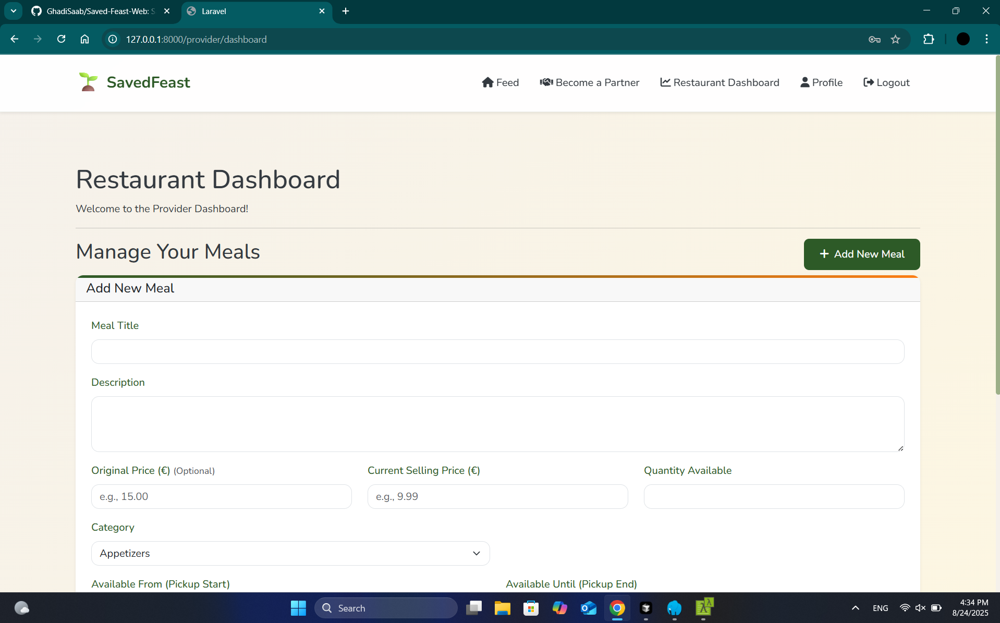
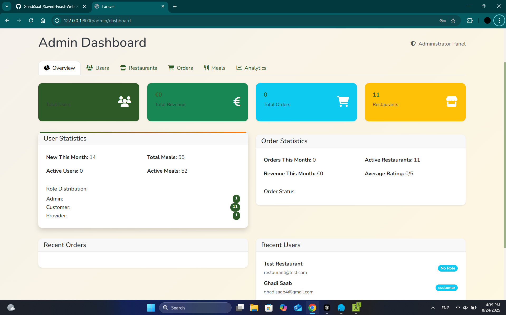

# SavedFeast Web Platform 🌐

<div align="center">


**A professional full-stack web platform for SavedFeast - an innovative food delivery platform that combats food waste by connecting restaurants with consumers.**

[](https://github.com/yourusername/savedfeast-web)
[](https://github.com/yourusername/savedfeast-web)
[](https://github.com/yourusername/savedfeast-web)
[](https://github.com/yourusername/savedfeast-web)

</div>

## 🌟 Features

### 🍽️ **Comprehensive Meal Management**
- **Advanced Meal Browsing**: Rich filtering with categories, price ranges, and search
- **Real-time Inventory**: Live meal availability and quantity tracking
- **Rich Media Support**: High-quality images with lazy loading
- **Detailed Meal Information**: Complete descriptions, pricing, and restaurant details

### 🛒 **Professional Order System**
- **Intelligent Cart Management**: Add, remove, and update quantities seamlessly
- **Real-time Pricing**: Dynamic price calculations with discounts
- **Order Tracking**: Complete order lifecycle from placement to completion
- **Status Updates**: Real-time order status notifications

### 🔐 **Enterprise-Grade Authentication**
- **Multi-Role System**: Consumer, Provider, and Admin roles with granular permissions
- **Laravel Sanctum**: Secure token-based authentication
- **Profile Management**: Comprehensive user profile editing
- **Session Security**: Automatic token refresh and secure session handling

### 🏪 **Restaurant Management**
- **Provider Dashboard**: Complete meal and order management for restaurants
- **Restaurant Applications**: Streamlined business registration process
- **Analytics**: Sales reports and performance metrics
- **Menu Management**: Easy meal creation and editing

### 👨‍💼 **Admin Administration**
- **User Management**: Complete user administration and role assignment
- **System Analytics**: Comprehensive platform statistics and insights
- **Content Moderation**: Meal and restaurant approval system
- **Platform Configuration**: System-wide settings and configurations

### 🎨 **Modern UI/UX Design**
- **Responsive Design**: Optimized for all devices and screen sizes
- **Bootstrap 5**: Professional, accessible design system
- **Dark/Light Themes**: Automatic theme switching
- **Progressive Web App**: Offline capabilities and app-like experience

### 🔧 **Technical Excellence**
- **Laravel 11**: Latest PHP framework with modern features
- **React 18**: Modern frontend with TypeScript support
- **API-First Architecture**: RESTful API with comprehensive documentation
- **Database Optimization**: Efficient queries and proper indexing
- **Security Best Practices**: Input validation, CORS, rate limiting

## 🖼️ Screenshots

<div align="center">

| Home Page | Meal Browsing | Shopping Cart | Order Management |
|-----------|---------------|---------------|------------------|
|  |  |  |  |

| Authentication | Provider Dashboard | Admin Panel | Mobile Responsive |
|----------------|-------------------|-------------|-------------------|
|  |  |  |  |

</div>

## 🛠️ Technology Stack

### **Backend (Laravel 11)**
- **PHP 8.2+**: Latest PHP with modern features
- **Laravel Framework**: Robust MVC framework
- **Laravel Sanctum**: API authentication
- **MySQL 8.0+**: Reliable database system
- **Eloquent ORM**: Powerful database abstraction

### **Frontend (React 18)**
- **React 18**: Modern UI library with hooks
- **TypeScript**: Type safety and better development experience
- **Bootstrap 5**: Professional CSS framework
- **React Router**: Client-side routing
- **Axios**: HTTP client for API communication

### **Development Tools**
- **Vite**: Fast build tool and development server
- **ESLint**: Code quality and consistency
- **Prettier**: Code formatting
- **PHPUnit**: PHP testing framework
- **Vitest**: Frontend testing

### **Infrastructure**
- **Docker**: Containerization support
- **Laravel Sail**: Docker development environment
- **GitHub Actions**: CI/CD pipeline
- **Composer**: PHP dependency management
- **npm**: Node.js package management

## 🚀 Quick Start

### **Prerequisites**

- **PHP** 8.2 or higher
- **Composer** 2.0+
- **Node.js** 18+ and npm
- **MySQL** 8.0+
- **Git**

### **Installation**

1. **Clone the repository**
   ```bash
   git clone https://github.com/yourusername/savedfeast-web.git
   cd savedfeast-web
   ```

2. **Install dependencies**
   ```bash
   # Backend dependencies
   composer install
   
   # Frontend dependencies
   npm install
   ```

3. **Environment configuration**
   ```bash
   # Copy environment file
   cp .env.example .env
   
   # Generate application key
   php artisan key:generate
   ```

4. **Database setup**
   ```bash
   # Create database
   mysql -u root -p -e "CREATE DATABASE savedfeast CHARACTER SET utf8mb4 COLLATE utf8mb4_unicode_ci;"
   
   # Run migrations and seed data
   php artisan migrate:fresh --seed
   
   # Create storage link
   php artisan storage:link
   ```

5. **Start development servers**
   ```bash
   # Start both backend and frontend
   npm run serve:full
   
   # Or start separately
   npm run serve:backend  # Backend only
   npm run serve:frontend # Frontend only
   ```

6. **Access the application**
   - **Backend API**: http://localhost:8000/api
   - **Frontend**: http://localhost:5173
   - **Admin Panel**: http://localhost:8000/admin

## 📁 Project Structure

```
SavedFeast-Web/
├── 🖥️ app/                          # Laravel application
│   ├── Console/Commands/           # Artisan commands
│   ├── Http/Controllers/           # API controllers
│   │   ├── API/                   # API endpoints
│   │   │   ├── AdminController.php
│   │   │   ├── AuthController.php
│   │   │   ├── MealController.php
│   │   │   └── OrderController.php
│   │   └── Controller.php
│   ├── Models/                     # Eloquent models
│   ├── Policies/                   # Authorization policies
│   └── Providers/                  # Service providers
├── 🎨 resources/                    # Frontend resources
│   ├── js/                        # React application
│   │   ├── components/            # React components
│   │   ├── context/               # React contexts
│   │   ├── routes/                # React pages
│   │   └── App.tsx                # Main app component
│   ├── css/                       # Stylesheets
│   ├── sass/                      # Sass files
│   └── views/                     # Blade templates
├── 🗄️ database/                     # Database files
│   ├── migrations/                # Database migrations
│   ├── seeders/                   # Database seeders
│   └── factories/                 # Model factories
├── 🧪 tests/                       # Test files
│   ├── Feature/                   # Feature tests
│   └── Unit/                      # Unit tests
├── 📖 docs/                        # Documentation
│   ├── api/                       # API documentation
│   └── screenshots/               # App screenshots
├── 🐳 docker/                      # Docker configuration
├── 📄 Configuration files
│   ├── composer.json              # PHP dependencies
│   ├── package.json               # Node.js dependencies
│   ├── vite.config.js             # Vite configuration
│   └── phpunit.xml                # PHPUnit configuration
└── 🚀 Deployment files
    ├── .github/                   # GitHub Actions
    └── docker-compose.yml         # Docker setup
```

## 🔌 API Documentation

### **Interactive Documentation**
- **OpenAPI/Swagger**: `docs/api/openapi.yaml`
- **Postman Collection**: `docs/api/SavedFeast_API.postman_collection.json`

### **Quick API Reference**

| Endpoint | Method | Description | Auth Required |
|----------|--------|-------------|---------------|
| `/api/register` | POST | User registration | ❌ |
| `/api/login` | POST | User authentication | ❌ |
| `/api/logout` | POST | User logout | ✅ |
| `/api/meals` | GET | List meals with filters | ❌ |
| `/api/meals/filters` | GET | Get filter options | ❌ |
| `/api/categories` | GET | Get meal categories | ❌ |
| `/api/orders` | GET/POST | User orders | ✅ |
| `/api/orders/{id}` | GET/PUT | Specific order | ✅ |
| `/api/user/profile` | POST | Update profile | ✅ |
| `/api/provider/meals` | GET/POST/PUT/DELETE | Provider meal management | ✅ (Provider) |
| `/api/admin/dashboard` | GET | Admin dashboard | ✅ (Admin) |

### **Authentication**
```bash
# Include Bearer token in requests
Authorization: Bearer {your_access_token}
```

### **Rate Limits**
- **Auth endpoints**: 6 requests/minute
- **Public endpoints**: 60 requests/minute
- **Authenticated endpoints**: 120 requests/minute
- **Provider endpoints**: 300 requests/minute
- **Admin endpoints**: 600 requests/minute

## 🧪 Testing

### **Running Tests**

```bash
# Run all tests
composer test

# Run tests with coverage
composer test:coverage

# Run tests in parallel
composer test:parallel

# Run specific test file
php artisan test tests/Feature/AuthTest.php

# Frontend tests
npm test
npm run test:coverage
```

### **Test Structure**

```
tests/
├── Feature/              # Feature tests
│   ├── AuthTest.php     # Authentication tests
│   ├── MealTest.php     # Meal management tests
│   └── OrderTest.php    # Order processing tests
├── Unit/                # Unit tests
│   └── ExampleTest.php  # Unit test examples
└── TestCase.php         # Base test class
```

### **Testing Best Practices**

- **Feature Tests**: Test complete user workflows
- **Unit Tests**: Test individual components and methods
- **Database Tests**: Use database transactions for isolation
- **API Tests**: Test all API endpoints and responses
- **Coverage**: Maintain >90% code coverage

## 🚀 Deployment

### **Production Environment**

```bash
# Set production environment
APP_ENV=production
APP_DEBUG=false
APP_URL=https://yourdomain.com

# Database configuration
DB_HOST=your-db-host
DB_DATABASE=your-db-name
DB_USERNAME=your-db-user
DB_PASSWORD=your-db-password

# Mail configuration
MAIL_MAILER=smtp
MAIL_HOST=your-smtp-host
MAIL_PORT=587
MAIL_USERNAME=your-email
MAIL_PASSWORD=your-password
MAIL_ENCRYPTION=tls

# File storage
FILESYSTEM_DISK=s3  # or other cloud storage
```

### **Deployment Steps**

1. **Prepare the application**
   ```bash
   composer install --optimize-autoloader --no-dev
   npm run build
   ```

2. **Database setup**
   ```bash
   php artisan migrate --force
   php artisan storage:link
   ```

3. **Cache optimization**
   ```bash
   php artisan config:cache
   php artisan route:cache
   php artisan view:cache
   ```

4. **Web server configuration**
   - Configure Apache/Nginx
   - Set up SSL certificate
   - Configure queue workers

### **Docker Deployment**

```bash
# Build and run with Docker
docker-compose up -d

# Or use Laravel Sail
./vendor/bin/sail up -d
```

## 🔧 Development

### **Available Commands**

```bash
# Backend commands
php artisan serve                    # Start Laravel server
php artisan migrate                 # Run migrations
php artisan migrate:fresh --seed    # Reset and seed database
php artisan make:controller         # Create controller
php artisan make:model              # Create model
php artisan make:migration          # Create migration
php artisan route:list              # List all routes
php artisan tinker                  # Interactive shell

# Frontend commands
npm run dev                         # Start development server
npm run build                       # Build for production
npm run preview                     # Preview production build
npm run lint                        # Run ESLint
npm run lint:fix                    # Fix linting issues
npm run type-check                  # Run TypeScript check

# Combined commands
npm run serve:full                  # Start both servers
composer test                       # Run PHP tests
npm test                           # Run frontend tests
```

### **Development Guidelines**

- **Code Style**: Follow PSR-12 and ESLint configuration
- **Commits**: Use conventional commit messages
- **Branches**: Use feature branches for new development
- **Testing**: Write tests for new features and bug fixes
- **Documentation**: Update documentation for API changes

## 🤝 Contributing

We welcome contributions! Please follow these steps:

1. **Fork the repository**
2. **Create a feature branch**
   ```bash
   git checkout -b feature/amazing-feature
   ```
3. **Make your changes**
4. **Run tests and linting**
   ```bash
   composer test
   npm run lint
   npm test
   ```
5. **Commit your changes**
   ```bash
   git commit -m 'feat: add amazing feature'
   ```
6. **Push to the branch**
   ```bash
   git push origin feature/amazing-feature
   ```
7. **Open a Pull Request**

### **Commit Message Convention**

We follow the [Conventional Commits](https://www.conventionalcommits.org/) specification:

- `feat:` New features
- `fix:` Bug fixes
- `docs:` Documentation changes
- `style:` Code style changes
- `refactor:` Code refactoring
- `test:` Test changes
- `chore:` Build process or auxiliary tool changes

## 🐛 Troubleshooting

### **Common Issues**

#### **Database Connection Issues**
```bash
# Check database configuration
php artisan config:clear
php artisan cache:clear

# Verify database connection
php artisan tinker
DB::connection()->getPdo();
```

#### **Frontend Build Issues**
```bash
# Clear node modules and reinstall
rm -rf node_modules package-lock.json
npm install

# Clear Vite cache
npm run dev -- --force
```

#### **Permission Issues**
```bash
# Set proper permissions
chmod -R 755 storage bootstrap/cache
chown -R www-data:www-data storage bootstrap/cache
```

#### **Composer Issues**
```bash
# Clear composer cache
composer clear-cache

# Update composer
composer self-update
```

### **Getting Help**

- 📖 **Documentation**: Check this README and inline code comments
- 🐛 **Issues**: Report bugs via [GitHub Issues](https://github.com/yourusername/savedfeast-web/issues)
- 💬 **Discussions**: Use [GitHub Discussions](https://github.com/yourusername/savedfeast-web/discussions)
- 📧 **Email**: Contact us at support@savedfeast.com

## 📄 License

This project is licensed under the MIT License - see the [LICENSE](LICENSE) file for details.

## 🙏 Acknowledgments

- **Laravel Team**: For the amazing PHP framework
- **React Team**: For the incredible UI library
- **Bootstrap Team**: For the excellent CSS framework
- **Open Source Community**: For the incredible libraries and tools

## 📞 Support

For support and questions:

- 📧 **Email**: support@savedfeast.com
- 🐛 **Issues**: [GitHub Issues](https://github.com/yourusername/savedfeast-web/issues)
- 💬 **Discussions**: [GitHub Discussions](https://github.com/yourusername/savedfeast-web/discussions)
- 📖 **Documentation**: Check the `docs/` folder

---

<div align="center">

**Built with ❤️ for a sustainable future**

[](https://github.com/yourusername/savedfeast-web)
[](https://github.com/yourusername/savedfeast-web)
[](https://github.com/yourusername/savedfeast-web/issues)

</div>
